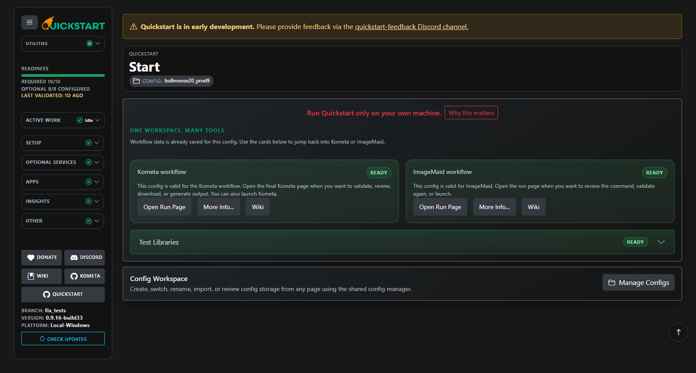
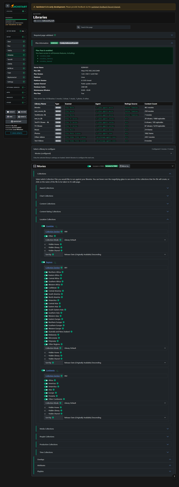
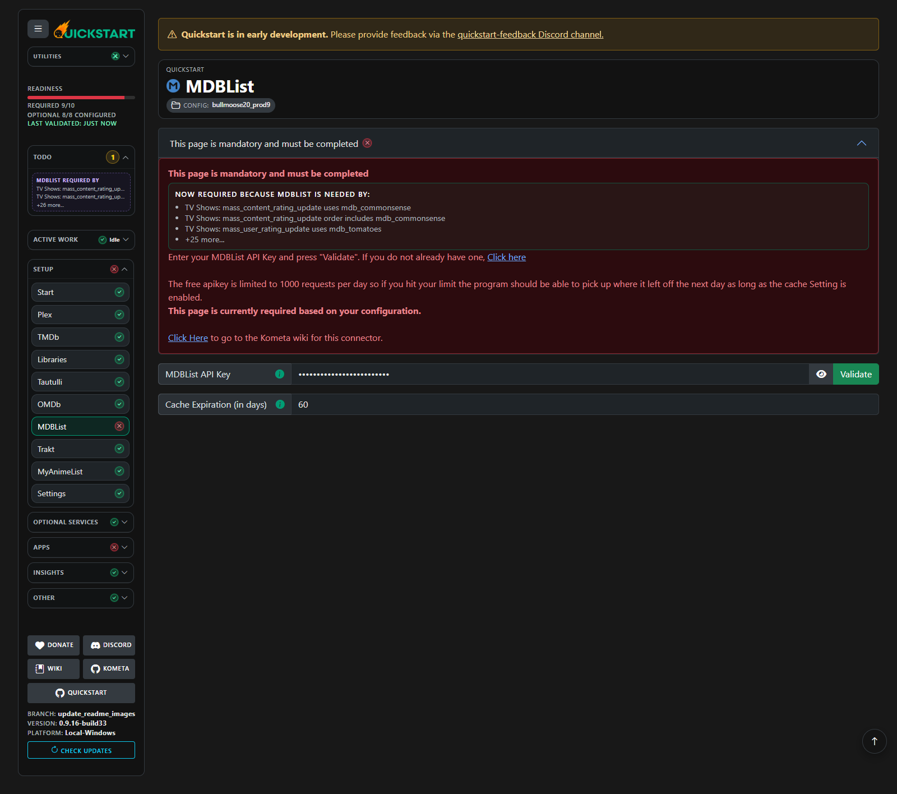
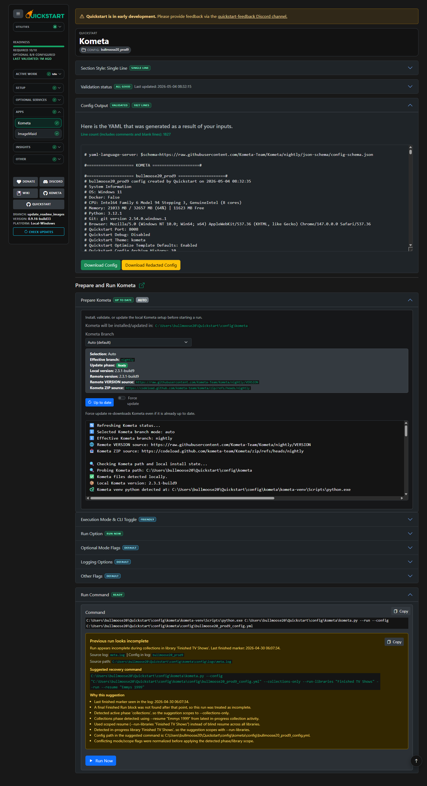
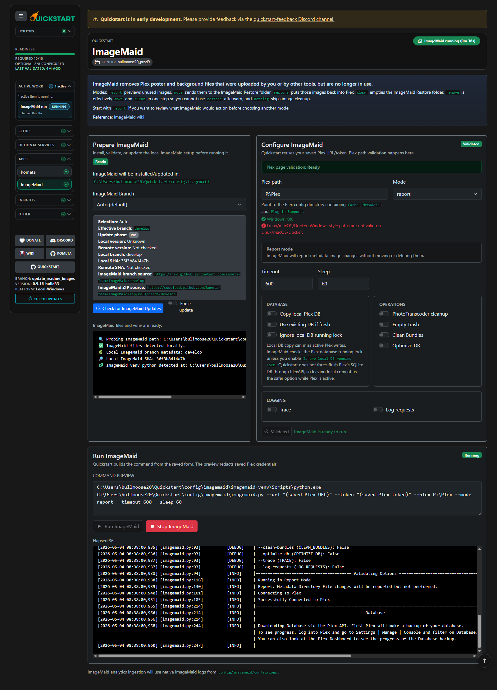
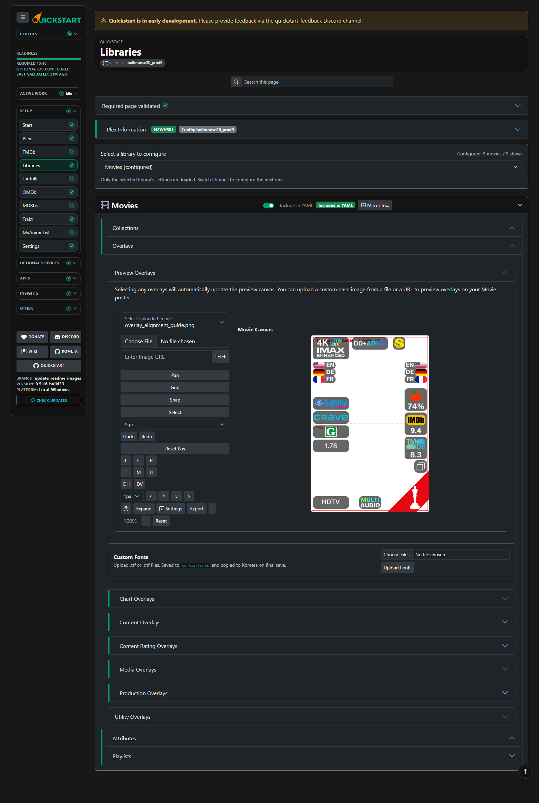
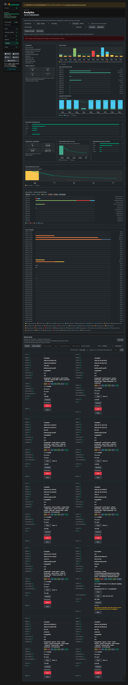
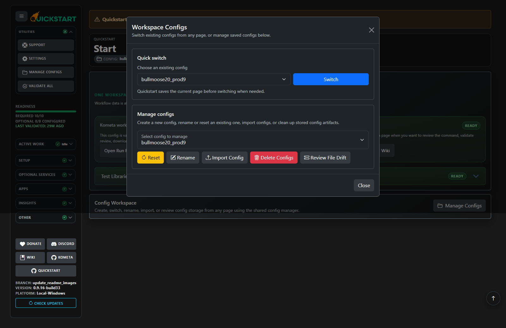
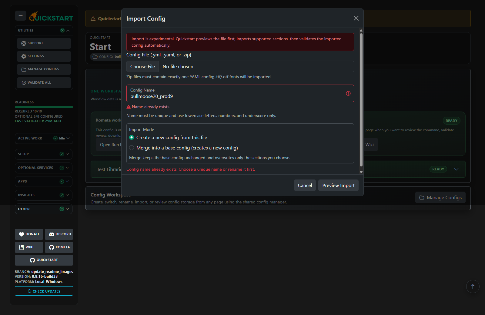

<!--logo-start-->

<!--logo-end-->
<!--shields-start-->
[](https://github.com/Kometa-Team/Quickstart/releases)
[](https://hub.docker.com/r/kometateam/quickstart)
[](https://hub.docker.com/r/kometateam/quickstart)
[](https://github.com/Kometa-Team/Quickstart/tree/develop)

[](https://discord.gg/NfH6mGFuAB)
[](https://www.reddit.com/r/Kometa/)
[](https://kometa.wiki/en/latest/home/scripts/quickstart.html)
[](https://github.com/sponsors/meisnate12)
[](https://github.com/sponsors/meisnate12)
<!--shields-end-->
<!--body1-start-->
## Welcome to Kometa Quickstart

## ✨ Features

Kometa Quickstart is more than just a YAML generator - it's a full interactive environment for configuring Kometa, running built-in Kometa-Team apps, and reviewing their results. Key features include:



### Multiple Ways to Run Quickstart
- **Local Python:** Works on Windows, macOS, and Linux
- **Frozen Builds:** Precompiled executables for Windows, macOS, and Linux (no Python required)
- **Docker Image:** Official image on Docker Hub with persistent `/config` volume support
- **Branch Support:** Choose between `master` (stable) and `develop` (bleeding-edge) branches for every runtime option

### Safe Playground Mode
- **Plex Test Libraries:** Downloadable from the start page so you can experiment without touching production libraries
- **No Risk to Production:** All Quickstart data, credentials, and configs are stored locally

### Config Management & History
- **SQLite-Backed Storage:** All configs and page data are stored in a database, so you can switch between configs at any time
- **Safe Config Switching:** Switching configs from the sidebar auto-saves the current page first, then refreshes readiness and TODO state for the selected config
- **Automatic Backups:** Every config is saved as a versioned `.yml` file for historical reference
- **Download & Run Anywhere:** Final configs can be downloaded and run outside Quickstart if preferred

### Config Bundles
- **Bundle export:** Quickstart can package a config as a ZIP bundle for backup, migration, restore, or sharing.
- **What a bundle contains:** A bundle includes exactly one YAML config plus supported extras such as imported `.ttf` / `.otf` fonts, `README.txt`, and managed `metadata_files`, `collection_files`, and `overlay_files` content.
- **Bundle import:** Quickstart previews bundle contents before import, imports supported sections and managed extras, and ignores unsupported payloads instead of blindly restoring everything. ZIPs wrapped in one top-level folder, such as files re-zipped by Windows Explorer, are normalized during import.
- **Restore behavior:** Importing a bundle creates or updates a Quickstart config profile, copies supported bundle assets into the workspace, and then runs validation/mapping flows before the imported config is treated as ready.
- **Clean YAML vs full bundle:** Use plain YAML when you only want the config text. Use a bundle when you also want the managed assets and fonts that belong with that config.

### Guided, Validated Workflow
- **Step-by-Step Pages:** Each section validates its own data, giving you instant feedback before proceeding
- **Library Telemetry:** Pulls real Plex server data (Plex Pass status, library types, agent/scanner compatibility)
- **Dynamic Toggles & Templates:** Rich UI for enabling collections, overlays, and builder template variables
- **Organized Library Defaults:** Collections, overlays, attributes, and playlists are grouped into logical accordions with override counters, visual override indicators, and scoped reset-to-defaults actions.
- **Library Mirroring:** Copy compatible library selections from one Plex library to another, then explicitly include the destination library in the generated config after validation.
- **Dependency-Aware Optional Pages:** Optional pages such as GitHub, Tautulli, OMDb, MDBList, Notifiarr, Gotify, ntfy, Apprise, Yamtrack, Webhooks, AniDB, Radarr, Sonarr, Trakt, and MyAnimeList become required when selected library features need them
- **TODO Sidebar:** Outstanding dependency and validation tasks are grouped into clickable cards that save the current page and open the affected setup page
- **Library-Scoped Playlists:** Playlist file selection now lives on the Libraries page so playlists stay tied to the libraries included in the generated YAML
- **Library Collection Files:** Add multiple raw `collection_files` entries per library with mixed `file`, `folder`, `url`, `git`, and `repo` sources, import them from existing configs, and validate that each entry resolves to non-empty YAML with a non-empty top-level `collections:` mapping before output
- **Library Metadata Files:** Add multiple `metadata_files` entries per library with mixed `file`, `folder`, `url`, `git`, and `repo` sources, import them from existing configs, and validate that each entry resolves to non-empty YAML with a non-empty top-level `metadata:` mapping before output
- **Library Overlay Files:** Add multiple raw `overlay_files` entries per library with mixed `file`, `folder`, `url`, `git`, and `repo` sources, import them from existing configs, and validate that each entry resolves to non-empty YAML with a non-empty top-level `overlays:` mapping before output
- **External YAML Editor:** Create or edit managed collection, metadata, and overlay YAML files from the Libraries page. The editor includes line numbers, search, select-all, undo/redo, YAML linting, tab/indent warnings, and non-blocking schema warnings so work can be saved while schema coverage continues to improve.
- **Folder and Remote YAML Helpers:** Folder entries offer a filtered picklist of editable top-level `.yml` / `.yaml` files, and remote `url`, `git`, or `repo` sources can be copied into a managed local file before editing.
- **Custom Repo Awareness:** `repo` collection, metadata, and overlay files are dependency-aware and point back to `Settings -> Custom Repo` when that base path is missing
- **Separator Helper:** Separator attributes can use Plex-driven placeholder picklists and live separator poster previews instead of requiring users to manually type opaque IDs.
- **Filtered Page Search:** Find matches on Libraries and Settings pages and auto-expand matching sections
- **Settings Cog:** Quick access to runtime controls like debug mode and port changes from anywhere




### Kometa Gates
- **Fail-Fast Setup Checks:** The Kometa page stops at the TODO gate when required setup work remains instead of building YAML or checking Kometa prematurely
- **Validation Freshness:** If bulk validation is stale, Quickstart automatically runs Validate All and refreshes workspace status before continuing
- **Config Before Runtime:** Quickstart builds and validates the generated config before checking Kometa or showing run controls
- **Kometa Update Guidance:** Missing Kometa is a hard blocker, while available Kometa updates are shown as guidance without blocking the run command

### Kometa Runtime Modes
- **Managed:** Quickstart installs and manages its own Kometa runtime inside the workspace. This gives the clearest support model and the full Quickstart runner experience.
- **Existing direct install:** Quickstart uses a real Kometa install it can directly access from the same environment. This must be the folder that contains `kometa.py`, `requirements.txt`, and `config/`.
- **External / containerized config path:** Quickstart does not control the Kometa runtime. Instead, it writes the generated YAML and managed assets to an external `config` path and can optionally read logs from an external log path.
- **Use `existing direct` when:** Quickstart can validate, check version/update availability, and launch the same Kometa install you already use, but you want to update that install manually outside Quickstart.
- **Use `external` when:** Quickstart can only see a mounted `config` folder such as a Docker/NAS/remote path, but not the Kometa runtime itself.
- **Existing direct tradeoffs:** Quickstart will not modify that Kometa install in place. If Quickstart detects a newer Kometa version, update the install manually outside Quickstart before running.
- **External mode tradeoffs:** Quickstart cannot launch or update Kometa directly in this mode. Analytics and logscan only work if the external log path is accessible, and Quickstart-specific run markers, resume hints, and maintenance-window orchestration metadata will not exist for runs launched outside Quickstart.

### Built-in App Runners

#### Kometa
- **One-Click Execution:** In `managed` mode, the Kometa page creates a Kometa virtual environment (if needed), installs dependencies, and runs `kometa.py` against the generated config
- **Run Command Builder:** Dynamically builds and previews CLI commands with flags like `--run`, `--operations-only`, `--times`, etc.
- **Runtime Flags & Environment Variables:** Supported Kometa runtime flags are grouped on the final page, including validation/schema options, logging options, run modes, and related environment variable guidance.
- **Validation Levels:** Kometa validation commands support `syntax`, `structure`, and `full` validate-level choices from the UI.
- **Process Management:** In `managed` and `existing direct` modes, start, stop, and monitor Kometa runs directly from the web interface
- **Maintenance-Aware Runs:** Detects Plex maintenance windows, pauses active runs, and queues new runs until maintenance ends (with global UI badges and toasts)
- **Incomplete Run Recovery:** If a Kometa run stops early, Quickstart preserves the run context and surfaces resume or recovery guidance when it can determine the affected scope
- **Mode-aware final page:** In `managed` mode, the final Kometa page includes install/update controls and run controls. In `existing direct` mode, the same page can validate the install, check version/update availability, and launch runs, but updates must be done manually outside Quickstart. In `external` mode, the page becomes a sync/status view that shows the external config target, log availability, and mode limitations instead of runtime controls.

This reduces the chance of Plex background maintenance colliding with long Kometa runs, keeps Plex more responsive during the window, and avoids wasting time starting a run that would immediately pause.

#### ImageMaid
- **Prepare / install / update flow:** Quickstart can install or update ImageMaid in its own managed directory before running it
- **Mode-aware validation:** The ImageMaid page validates mode-specific requirements such as restore-folder availability before a run starts
- **Guided run gating:** Run controls stay hidden until ImageMaid is installed and validated, with explicit guidance for the next required step
- **Maintenance-aware start protection:** ImageMaid starts are blocked during Plex maintenance windows instead of colliding with active maintenance

#### Optional Integrations
- **Service validation pages:** Quickstart includes dedicated setup pages for GitHub, Tautulli, OMDb, MDBList, Notifiarr, Gotify, ntfy, Apprise, Yamtrack, Webhooks, AniDB, Radarr, Sonarr, Trakt, and MyAnimeList.
- **Credential checks:** Optional services stay optional until selected features need them, and validation checks the configured endpoint or token before those dependencies are treated as ready.
- **Yamtrack validation:** Yamtrack validation verifies credentials and reports the detected server version when the instance exposes it.




### Live Previews & Assets
- **Overlay Preview Generator:** Combines overlays and template variables into real-time preview images
- **Custom Artwork Uploads:** Drag-and-drop or fetch library images from a URL so you can see what the overlays look like on your favorite poster.
- **Overlay Image Source Overrides:** Supported overlay families can override built-in badge images per key using `file`, `url`, `git`, or `repo` sources, validate those images before save, preview the result live on the canvas, and optionally convert remote sources into managed local files with `Make Local`.
- **Managed Overlay Cleanup:** When a managed override image is replaced or removed, Quickstart cleans up the old managed file and can sweep unreferenced managed override images to avoid config bloat.



### Automatic Updates
- **Quickstart Self-Updater:** One-click update to latest master or develop branch
- **Kometa Sync:** In `managed` mode, Quickstart can pull and update Kometa itself (nightly/master) before running. In `existing direct` mode, Quickstart only checks version/update availability and expects you to update that install manually outside Quickstart.
- **ImageMaid Sync:** Option to pull and update ImageMaid itself (develop/master) before running

### Themes & Personalization
- **Theme Picker:** Switch between Kometa, Plex, Jellyfin, Emby, Seerr, and more with instant apply

### Analytics
- **Cross-app history:** Analytics tracks both Kometa and ImageMaid runs from Quickstart-managed runtime logs and archives
- **External Kometa awareness:** If you use external Kometa mode and Quickstart can read the configured external log path, Analytics can still ingest those logs, but runs launched outside Quickstart will be missing Quickstart-specific markers and maintenance metadata
- **Reingest & analytics:** Rebuild run history from:
  - `config/kometa/config/logs`
  - `config/imagemaid/config/logs`
  - `config/cache/logscan/archive/kometa`
  - `config/cache/logscan/archive/imagemaid`
- **Reingest-safe loading:** While a reset or full reingest is running, the Analytics page polls lightweight reingest status instead of doing heavy trend and run-table work on every refresh.
- **Stable run tracking:** Runs are deduped with a stable `run_key` and cached in `config/cache/logscan/ingest_cache.json`.
- **Missing people requests:** Deduped output is written to `config/cache/logscan/meta_people_missing.log` (metadata in `meta_people_missing.json`).
- **UI helpers:** App/config/time-range filters, sortable table headers, analytics breakdowns, and per-run “Report” recommendations.
- **Validation-run awareness:** Kometa validation-only logs are recognized as completed validation runs, and partial logs can still use available line timestamps for start/end/duration context when a full finished-run block is absent.
- **Independent retention:** Kometa and ImageMaid archived logs each have their own retention setting in Quickstart Settings
- **Startup migrations:** Quickstart can perform a one-time Analytics reset + reingest on startup when a release needs historical log data rebuilt for a new feature.

#### Startup Analytics Migrations

Quickstart supports versioned one-time Analytics migrations for releases that need existing `meta*.log*` history reprocessed without requiring you to open the Analytics page manually.

- `QS_LOGSCAN_STARTUP_MIGRATIONS=1`
  Default is enabled. Set this to `0` in `config/.env` if you need to temporarily suppress automatic startup migrations.
- `QS_LOGSCAN_MIGRATION_LEVEL_DONE=0`
  Quickstart writes this value back to `config/.env` after a startup migration succeeds. It records the highest migration level already applied on that installation.
- `REQUIRED_LOGSCAN_MIGRATION_LEVEL`
  This is a code constant in `quickstart.py`. Release builds bump this integer when they need a one-time reset + reingest for a new Analytics capability.

How it works:

- On startup, Quickstart compares `QS_LOGSCAN_MIGRATION_LEVEL_DONE` with the code's `REQUIRED_LOGSCAN_MIGRATION_LEVEL`.
- If the completed level is lower, Quickstart starts a background Analytics migration that resets trend data and reingests all available supported runtime logs.
- If a user skips releases, the higher required level still triggers the migration automatically on the next startup.
- If this is a first-time Quickstart setup and no supported runtime logs exist yet, Quickstart defers the migration instead of marking it complete. The migration remains pending until logs exist on a future startup.
- If a reingest is already running, Analytics reconnects to the active job instead of starting a second one.

### Logscan Analyzer & Analytics Page
- **Logscan Analyzer:** Parses Quickstart-managed Kometa and ImageMaid runtime logs to surface errors, run summaries, and missing items.
- **Analytics Page:** Interactive dashboard for cross-app run history, scope-first filters, and per-run recommendations.



### Import Existing Config
- **Import Config:** Launch import from `Manage Configs` in the Utilities menu to prefill settings, libraries, and templates.
- **YAML or Config Bundle ZIP:** Zip imports must contain exactly one YAML config. Supported extras are limited to `.ttf` / `.otf` fonts, `README.txt`, and managed `metadata_files`, `collection_files`, and `overlay_files` content. ZIPs may also contain a single wrapper folder around the exported bundle contents.
- **YAML anchors and aliases:** Config imports support YAML anchors, aliases, and `<<` merge keys. Quickstart resolves them during import and stores expanded values, so generated output does not preserve the original anchor syntax.
- **Preview required:** Quickstart always runs a preview before import and shows a line‑by‑line report (`imported / not imported`) with filters (All/Imported/Not Imported/Comments) and a downloadable report.
- **Plex credentials prompt:** If the import contains libraries, Plex validation is required for mapping. Quickstart will prompt for Plex URL/token if none are present; if the credentials in the file fail validation, you’ll be prompted to correct them and re‑run Preview.
- **Library mapping:** Imported library names must be mapped to Plex libraries (or ignored) before confirming the import; you can re‑preview after mapping.
- **Metadata file import:** Library `metadata_files` import supports `file`, `folder`, `url`, `git`, and `repo` entries. Quickstart currently validates file or folder resolution, YAML parsing, and a non-empty top-level `metadata:` mapping, but it does not fully validate Kometa metadata schema yet.
- **Collection file import:** Library `collection_files` import supports `file`, `folder`, `url`, `git`, and `repo` entries. Quickstart currently validates file or folder resolution, YAML parsing, and a non-empty top-level `collections:` mapping, but it does not fully validate Kometa collection file schema yet.
- **Unsupported bundle contents:** Files outside the supported config/font/managed-asset set are reported during preview instead of being silently imported.
- **After import:** Quickstart stays on the Welcome page, runs bulk validation automatically, then refreshes the workspace status for the imported config.

#### What happens after import?

After you confirm an import, Quickstart saves the new config, shows a compact summary of imported sections, skipped sections, mapped libraries, and copied fonts, then runs bulk validation automatically. If validation fails for any page, Quickstart keeps the summary open with direct links to the failed pages. If validation passes, it refreshes the Welcome page with the imported config selected.




### Quickstart Scope
- **Quickstart support vs Kometa support:** The Support Info workflow is for Quickstart issues. Kometa runtime issues should be handled in Kometa support channels.

### Support & Troubleshooting
- **Support Info (every page):** Use the Support button in the Utilities menu to open Support Info and gather system info plus the Quickstart log tail.
- **Redaction notice:** We attempt to redact secrets, but always review before posting.
- **Log file:** `config/logs/quickstart.log`

### Data & Privacy (Quickstart)
- **Local-first:** Config data is stored locally in SQLite and versioned `.yml` files in `config/`.
- **Network access:** Quickstart only contacts external services for validation, remote asset fetches, update checks, and explicit update or sync actions.

Quickstart is a guided Web UI that helps you create a configuration file for Kometa and run supported Kometa-Team companion apps like ImageMaid from the same workspace.

### Development Transparency
- Through December 2025, development used limited to no AI assistance.
- After December 2025, some features, fixes, and UI tweaks were added with help from Codex.

Special thanks to [meisnate12](https://github.com/meisnate12), [bullmoose20](https://github.com/bullmoose20), [chazlarson](https://github.com/chazlarson), and [Yozora](https://github.com/yozoraXCII) for their contributions to this tool.

## Table of Contents

- [Welcome to Kometa Quickstart](#welcome-to-kometa-quickstart)
- [✨ Features](#-features)
  - [Multiple Ways to Run Quickstart](#multiple-ways-to-run-quickstart)
  - [Safe Playground Mode](#safe-playground-mode)
  - [Config Management \& History](#config-management--history)
  - [Config Bundles](#config-bundles)
- [Guided, Validated Workflow](#guided-validated-workflow)
  - [Kometa Gates](#kometa-gates)
  - [Kometa Runtime Modes](#kometa-runtime-modes)
  - [Built-in App Runners](#built-in-app-runners)
    - [Kometa](#kometa)
    - [ImageMaid](#imagemaid)
    - [Optional Integrations](#optional-integrations)
  - [Live Previews \& Assets](#live-previews--assets)
  - [Automatic Updates](#automatic-updates)
  - [Themes \& Personalization](#themes--personalization)
  - [Analytics](#analytics)
    - [Startup Analytics Migrations](#startup-analytics-migrations)
  - [Logscan Analyzer \& Analytics Page](#logscan-analyzer--analytics-page)
  - [Import Existing Config](#import-existing-config)
    - [What happens after import?](#what-happens-after-import)
  - [Quickstart Scope](#quickstart-scope)
  - [Support \& Troubleshooting](#support--troubleshooting)
  - [Data \& Privacy (Quickstart)](#data--privacy-quickstart)
- [Table of Contents](#table-of-contents)
- [Prerequisites](#prerequisites)
- [Installing Quickstart](#installing-quickstart)
- [1 - Installing on Windows](#1---installing-on-windows)
- [2 - Installing on Mac](#2---installing-on-mac)
- [3 - Installing on Ubuntu (Linux)](#3---installing-on-ubuntu-linux)
- [4 - Running in Docker](#4---running-in-docker)
  - [`docker run`](#docker-run)
  - [`docker compose`](#docker-compose)
- [5 - Installing locally](#5---installing-locally)
  - [Windows:](#windows)
  - [Linux/Mac:](#linuxmac)
  - [Missing stdlib C extensions (sqlite3, _ssl, etc.)](#missing-stdlib-c-extensions-sqlite3-_ssl-etc)
  - [Debugging \& Changing Ports](#debugging--changing-ports)
- [Testing](#testing)
  - [Developer Testing](#developer-testing)
- [Frontend Tooling](#frontend-tooling)
- [Appendix: Dependency Map](#appendix-dependency-map)
  - [MyAnimeList-specific mass update operations](#myanimelist-specific-mass-update-operations)
  - [Notes](#notes)

## Prerequisites

Whether you should complete the Kometa installation walkthrough before running Quickstart depends on the Kometa runtime mode you plan to use:

- **Managed:** Optional. Quickstart can create and manage its own Kometa runtime inside the workspace.
- **Existing direct install:** Recommended. This prepares the Kometa install Quickstart will validate, check, and launch directly. Updates for that install should be done manually outside Quickstart.
- **External / containerized config path:** Optional for Quickstart itself. Use this mode when Quickstart only needs to write config and optionally read logs from an external Kometa setup.

Running Quickstart first is now a valid path if you plan to use `managed` mode. The walkthrough remains useful when you intend to point Quickstart at an already-installed Kometa runtime.

Completing the walkthrough will also familiarize you with creating a Python virtual environment, which is recommended when running this as a Python script.

## Installing Quickstart

There are five primary ways to install and run Quickstart, listed from simplest to more advanced.
<!--body1-end-->
> [!CAUTION]
> **We strongly recommend running this yourself rather than relying on someone else to host Quickstart.**
>
> This ensures that connection attempts are made exclusively to services and machines accessible only to you. Additionally, all credentials are stored locally, safeguarding your sensitive information from being stored on someone else's machine.

<!--body2-start-->
## 1 - Installing on Windows

- Go to the [Releases page](https://github.com/Kometa-Team/Quickstart/releases) and download the standalone `.exe`.

- Choose the build you want (`master` or `develop`) and download the appropriate asset.

- Place the file in its own folder and double-click to run it.

- Manage Quickstart from the system tray icon.


## 2 - Installing on Mac

- Go to the [Releases page](https://github.com/Kometa-Team/Quickstart/releases) and download the standalone file.

- Choose the build you want (`master` or `develop`) and download the appropriate asset.

- Place the file in its own folder.

- Open Terminal, navigate to the folder, and make the file executable: `chmod 755 <name of file>`.

- Run it: `./<name of file>`.

- You may need to allow unsigned applications in macOS System Settings under Privacy & Security.


-  Manage Quickstart from the system tray icon.


## 3 - Installing on Ubuntu (Linux)

- Go to the [Releases page](https://github.com/Kometa-Team/Quickstart/releases) and download the standalone file.

- Choose the build you want (`master` or `develop`) and download the appropriate asset.

- Place the file in its own folder.

- Open a terminal, navigate to the folder, and make the file executable: `chmod 755 <name of file>`.

- Run it: `./<name of file>`.

- Manage Quickstart from the system tray icon.


<!--body2-end-->
> [!WARNING]
> You will likely need to perform these steps first to have a system tray icon show up:

Ubuntu/Debian:
```
sudo apt update
sudo apt install -y libxcb-xinerama0 libxcb-xinerama0-dev libxcb-icccm4 libxcb-image0 libxcb-keysyms1 libxcb-render-util0
```
Fedora 42+:

On GNOME (especially on Wayland), classic system tray icons are not shown by default. Apps using Qt/PyQt “system tray” often appear to be “missing” even though they’re running fine.

The most common fix (GNOME): install AppIndicator support

On Fedora, install the GNOME extension that restores tray/appindicator icons:

```
sudo dnf install gnome-shell-extension-appindicator
```

Then enable it:


Open Extensions app (or “Extension Manager” if you use it)

Enable AppIndicator and KStatusNotifierItem Support (After a new installation, you might need to reboot before you see both)

After that, the tray icon usually appears.


<!--body3-start-->
## 4 - Running in Docker

NOTE: The `/config` directory in these examples is NOT the Kometa config directory. Create a Quickstart-specific directory and map it to `/config`.

Here are some minimal examples:

### `docker run`

```
docker run -it -v "/path/to/config:/config:rw" kometateam/quickstart:develop
```

### `docker compose`

```yaml
services:
  quickstart:
    image: kometateam/quickstart:develop
    container_name: quickstart
    ports:
      - 7171:7171
    environment:
      - TZ=TIMEZONE #optional
    volumes:
      - /path/to/config:/config #edit this line for your setup
    restart: unless-stopped
```

## 5 - Installing locally

### Windows:


1.  Ensure Git and Python are installed.

Git: https://git-scm.com/book/en/v2/Getting-Started-Installing-Git

Python: https://www.python.org/downloads/windows/

2.  `git clone` Quickstart, switch to your preferred branch (`develop`, `master`), create and activate a virtual environment, upgrade pip, and install the requirements.

Run the following commands within your Command Prompt window:

```
cd c:\this\dir\has
git clone https://github.com/Kometa-Team/Quickstart
cd Quickstart
git checkout develop
git stash
git stash clear
git pull
python -m venv venv
.\venv\Scripts\activate
python -m pip install --upgrade pip
python -m pip install -r requirements.txt
```

4.  Run Quickstart. After completing the guided pages, the final page will automatically create the Kometa virtual environment, install the requirements, and allow you to run `kometa.py` using the validated config generated by Quickstart.

```
python quickstart.py
```

### Linux/Mac:


1.  Ensure Git and Python are installed.

Git: https://git-scm.com/book/en/v2/Getting-Started-Installing-Git

Python:

Mac: https://www.python.org/downloads/macos/

Ubuntu/Debian: ```sudo apt-get install python3```

Fedora: ```sudo dnf install python3```

2.  `git clone` Quickstart, switch to your preferred branch (`develop`, `master`), create and activate a virtual environment, upgrade pip, and install the requirements.

```
cd /this/dir/has
git clone https://github.com/Kometa-Team/Quickstart
cd Quickstart
git checkout develop
git stash
git stash clear
git pull
python3 -m venv venv
source venv/bin/activate
python3 -m pip install --upgrade pip
python3 -m pip install -r requirements.txt
```

4.  Run Quickstart. After completing the guided pages, the final page will automatically create the Kometa virtual environment, install the requirements, and allow you to run `kometa.py` using the validated config generated by Quickstart.

```
source venv/bin/activate
python3 quickstart.py
```

At this point, Quickstart has been installed and you should see something similar to this:


Quickstart should launch a browser automatically. If you are on a headless machine (Docker or Linux without a GUI), open a browser and navigate to the IP address of the machine running Quickstart; you should be taken to the Quickstart Welcome Page.

- Manage Quickstart from the system tray icon


### Missing stdlib C extensions (sqlite3, _ssl, etc.)

If Quickstart refuses to start with a message that begins:

```
========================================================================
Quickstart cannot start: your Python is missing required C extensions
========================================================================
```

...it means your Python interpreter itself is broken — this is **not** a Quickstart bug. It happens most often when Python is installed via `pyenv`, `asdf`, or a manual `./configure && make install` build on a host that doesn't have the required system development headers. Python's build silently skips the affected C extension (e.g. `_sqlite3`, `_ssl`), leaving a Python that mostly works but explodes the moment anything touches the missing module.

**The fix is to install the OS development headers, then rebuild Python:**

| OS | Install the headers | Then rebuild Python |
|---|---|---|
| Debian / Ubuntu | `sudo apt install libsqlite3-dev libssl-dev` | `pyenv uninstall 3.14.x && pyenv install 3.14.x` |
| Fedora / RHEL / CentOS | `sudo dnf install sqlite-devel openssl-devel` | (same, for your version manager) |
| macOS (Homebrew) | `brew install sqlite3 openssl` | (same) |

After reinstalling Python, **recreate your virtual environment** — old venvs still point at the broken interpreter:

```
rm -rf venv
python3 -m venv venv
source venv/bin/activate
pip install -r requirements.txt
```

If you're using a Python that ships from your OS vendor (`apt install python3.13`, the official `python.org` installer, the Homebrew `python@3.13` formula, or the prebuilt CPython that `uv` downloads), you should not hit this at all — those builds always ship with SQLite and OpenSSL support.

### Debugging & Changing Ports

You can enable debug mode to add verbose logging to the console window.

There are four ways to enable debugging:

- Add `--debug` to your Run Command, for example: `python quickstart.py --debug`.

- Open the `.env` file at the root of the Quickstart directory, and set `QS_DEBUG=1` (restart required).

- Use the Quickstart system tray icon to toggle it on or off (no restart required).

- Use the Settings button in the Utilities menu within the Web UI to toggle it on or off (no restart required).

Quickstart runs on port 7171 by default. You can change it in one of four ways:

- Add `--port=XXXX` to your Run Command, for example: `python quickstart.py --port=1234`

- Open the `.env` file at the root of the Quickstart directory, and set `QS_PORT=XXXX` where XXXX is the port you want to run on. (restart required)

- Use the Quickstart system tray icon to choose a new port (restarts automatically).

- Use the Settings button in the Utilities menu within the Web UI to choose a new port (restarts automatically).

## Testing

Quickstart uses pytest for unit/integration tests and Playwright for E2E tests. For the JavaScript test suite (Vitest) and the Vite bundle build, see the [Frontend Tooling](#frontend-tooling) section.

### Developer Testing

The Python test runner is cross-platform:

- `scripts/run_tests.py` is the source-of-truth runner for Windows, macOS, and Linux.
- `scripts/run-tests.ps1` is only a Windows PowerShell wrapper around `scripts/run_tests.py`.
- `scripts/run_tests.py --setup` installs Python requirements, Node dependencies, and Playwright browsers.

#### Windows (PowerShell)

First-time setup:

```powershell
python -m venv venv
.\venv\Scripts\Activate.ps1
python scripts/run_tests.py --setup
```

Normal test and lint flow:

```powershell
python scripts/run_tests.py --lint
python scripts/run_tests.py --repochecks
python scripts/run_tests.py
python scripts/run_tests.py --e2e
python scripts/run_tests.py --all
```

If you prefer the Windows wrapper:

```powershell
.\scripts\run-tests.ps1 -Lint
.\scripts\run-tests.ps1 -RepoChecks
.\scripts\run-tests.ps1
.\scripts\run-tests.ps1 -E2E
.\scripts\run-tests.ps1 -All
```

#### macOS and Linux

These steps are identical on macOS and Linux:

```bash
python3 -m venv venv
source venv/bin/activate
python scripts/run_tests.py --setup
```

Normal test and lint flow:

```bash
python scripts/run_tests.py --lint
python scripts/run_tests.py --repochecks
python scripts/run_tests.py
python scripts/run_tests.py --e2e
python scripts/run_tests.py --all
```

#### Direct commands

Use these when you want to run individual layers yourself instead of the wrapper:

```bash
npm run lint:eslint
python -m pre_commit run --all-files
python -m pytest -p pytest_progress_plugin tests -m "not e2e and not ratings_matrix" -vv -o console_output_style=count
python -m pytest -p pytest_progress_plugin tests -m e2e -vv -o console_output_style=count
```

Fast focused paths:

```powershell
.\venv\Scripts\python.exe -m pytest tests\test_importer_edge_cases.py
.\venv\Scripts\python.exe -m pytest tests\test_workspace_dependency_logic.py
.\venv\Scripts\python.exe -m pytest tests\test_core_backend.py -k final
```

Unix/macOS equivalents:

```bash
venv/bin/python -m pytest tests/test_importer_edge_cases.py
venv/bin/python -m pytest tests/test_workspace_dependency_logic.py
venv/bin/python -m pytest tests/test_core_backend.py -k final
```

Notes for Playwright on Windows:

- Playwright requires named pipes. If you see `Access is denied`, re-run PowerShell as Administrator or adjust security policy to allow Playwright browser processes.
- E2E tests load Bootstrap from `cdn.jsdelivr.net`. If you’re behind a strict firewall, allowlist that host or the tests may fail to render the UI correctly.

## Frontend Tooling

Quickstart uses [Vite](https://vitejs.dev/) to bundle its JavaScript. Templates pick the served asset via the `asset_url()` Jinja global (implemented in `modules/helpers/_vite_manifest.py`):

- If `static/dist/.vite/manifest.json` exists, pages load hashed, minified bundles like `/static/dist/000-base-DKccW2Od.js`. Filenames are content-hashed for cache busting.
- Otherwise, pages fall back to raw source files from `/static/local-js/`.

The fallback is deliberate: `python quickstart.py` after a fresh `git clone` works with zero build step, and contributors who only touch Python/templates don't need Node installed.

### Where the build runs

| Environment | Who builds `static/dist/` |
|---|---|
| Local dev (Python only) | Nobody — falls back to `/static/local-js/` source files. Fully functional. |
| Local dev (JS work) | You, via `npm run build` when you want to test optimized output |
| CI | `Vite Build` job in `.github/workflows/lint.yml` on every push/PR (validates that bundling works; output not deployed) |
| Docker images | `jsbuild` stage of `Dockerfile` / `Dockerfile.arm7` (Node 22, runs on `$BUILDPLATFORM` for fast multi-arch builds) |
| Windows/macOS/Linux binaries | `Setup Node` + `Build JS Bundles` steps in `validate-pull.yml` and `release-notification.yml`, before PyInstaller runs |

The end result is that **every shipped Quickstart instance** — Docker (amd64/arm64/arm7) and every native binary — ships with hashed, minified JS bundles baked in. Users see ~40-50% smaller JS downloads and get proper cache invalidation on every deploy.

### For contributors editing JavaScript

If you're only touching Python / templates / static CSS, you can ignore this whole section. If you're editing files under `static/local-js/`:

**One-time setup:**

```
npm install
```

**Everyday commands:**

```
npm run dev            # Vite dev server on http://localhost:5173 (HMR for ESM files)
npm run build          # emits production bundles into static/dist/ (gitignored)
npm run preview        # serves the built bundles for a quick smoke test
npm test               # Vitest, one-shot run (used by CI)
npm run test:watch     # Vitest in watch mode
npm run lint:eslint    # ESLint over static/local-js/
```

**When to run `npm run build` locally:**

- You want to see the production bundle in your browser (path validation, cache-busting behavior, minification impact).
- You want to verify your change doesn't break the Vite build before pushing (CI will catch this anyway, but faster locally).

**When you can skip it:**

- Regular development. `python quickstart.py` serves your edits directly from `/static/local-js/` via the fallback path — no build step, no rebuild loop.

### CI enforcement

Both Vitest and the Vite build are enforced in CI via `.github/workflows/lint.yml`:

- **`Vitest` job** — runs `npm test` on every push/PR (all `tests/js/**/*.test.js`)
- **`Vite Build` job** — runs `npm run build` and verifies that the expected page-scale entries (`000-base`, `001-start`, `010-plex`, `025-libraries`, `900-kometa`, `905-analytics`, `eventHandler`, `overlayHandler`) appear in the manifest. Prevents auto-discovery from silently dropping an entry.

### Which files Vite knows about

Every file in `static/local-js/*.js` whose first non-comment/non-blank token is `import` or `export` is auto-discovered as a Vite entry point. Files under `static/local-js/modules/` are treated as dependencies, not entries. Classic scripts with no top-level `import`/`export` — such as `100-anidb.js` and `915-imagemaid.js` — are intentionally skipped because bundling them would just copy the source. See `vite.detectModuleEntry.mjs` for the exact detection logic (unit-tested in `tests/js/detectModuleEntry.test.js`).

JS tests live under `tests/js/` (mirroring the existing `tests/` convention for Python tests) and use the jsdom environment so DOM-touching code can be exercised without a real browser.

## Appendix: Dependency Map

This appendix documents the current rules that promote optional setup pages into the menu TODO table. A dependency card appears only when the related page exists in the active template list and at least one active library triggers one of the rules below.

An "active library" means the library include toggle is enabled (`*-library` is truthy). Disabled libraries do not create dependency TODO cards.

| TODO card / page | Step key | Trigger source in Libraries | Exact trigger rule | Example menu reason |
| --- | --- | --- | --- | --- |
| Tautulli | `030-tautulli` | Collections | `collection_tautulli` enabled on an active library | `Movies: Tautulli Charts collection enabled` |
| OMDb | `050-omdb` | Mass update attributes | Any `mass_*` attribute that uses an `omdb` source, including `_order` lists containing `omdb*` | `Movies: mass_content_rating_update uses omdb` |
| MDBList | `060-mdblist` | Mass update attributes; ratings overlays | Any `mass_*` attribute that uses an `mdb` source, any `_order` list containing `mdb*`, or ratings overlay image set to `letterboxd`, `metacritic`, `rt_tomato`, `rt_popcorn`, or `mdb` | `Movies: movie ratings overlay uses mdb` |
| AniDB | `100-anidb` | Mass update attributes; collections; template collections; ratings overlays | Any `mass_*` attribute that uses an `anidb` source, any `_order` list containing `anidb*`, `collection_use_anidb`, template collection child ids ending in `use_anidb`, or ratings overlay image set to `anidb` | `Anime Shows: AniDB Popular collection enabled` |
| Radarr | `110-radarr` | Library attributes; collections; template collections | Any enabled/configured `radarr_add_all*` or `radarr_remove_by_tag*` attribute, any collection id starting with `collection_radarr_`, or any template collection child id starting with `radarr_add_missing_` | `Movies: radarr_add_all enabled` |
| Sonarr | `120-sonarr` | Library attributes; collections; template collections | Any enabled/configured `sonarr_add_all*` or `sonarr_remove_by_tag*` attribute, any collection id starting with `collection_sonarr_`, or any template collection child id starting with `sonarr_add_missing_` | `TV Shows: sonarr_add_all enabled` |
| Trakt | `130-trakt` | Collections; ratings overlays | `collection_trakt` enabled on an active library, or ratings overlay image set to `trakt` | `TV Shows: Trakt Charts collection enabled` |
| MyAnimeList | `140-mal` | Collections; supported mass update attributes; ratings overlays | `collection_myanimelist`, supported `mass_*` operations using `mal`, `mal_english`, or `mal_japanese`, matching `_order` lists containing those values, or ratings overlay image set to `mal` | `Anime: MyAnimeList Charts collection enabled` |

### MyAnimeList-specific mass update operations

The following attribute operations will trigger the MyAnimeList TODO card when they use `mal`, `mal_english`, or `mal_japanese` directly or through the corresponding `_order` list:

| Operation |
| --- |
| `mass_genre_update` |
| `mass_content_rating_update` |
| `mass_original_title_update` |
| `mass_studio_update` |
| `mass_originally_available_update` |
| `mass_added_at_update` |
| `mass_audience_rating_update` |
| `mass_critic_rating_update` |
| `mass_user_rating_update` |

### Notes

- Duplicate dependency reasons are deduplicated before being shown in the menu.
- The TODO table is driven from stored Libraries data, not just the current page URL.
- Only MyAnimeList uses an explicit operation allowlist. OMDb, MDBList, and AniDB mass-update dependency checks are source-prefix driven and already cover matching `mass_*` attributes plus `_order` lists.
- Validation status still affects whether the card is marked warning vs ready; the table above only covers what makes a provider page become required in the first place.

<!--body3-end-->
